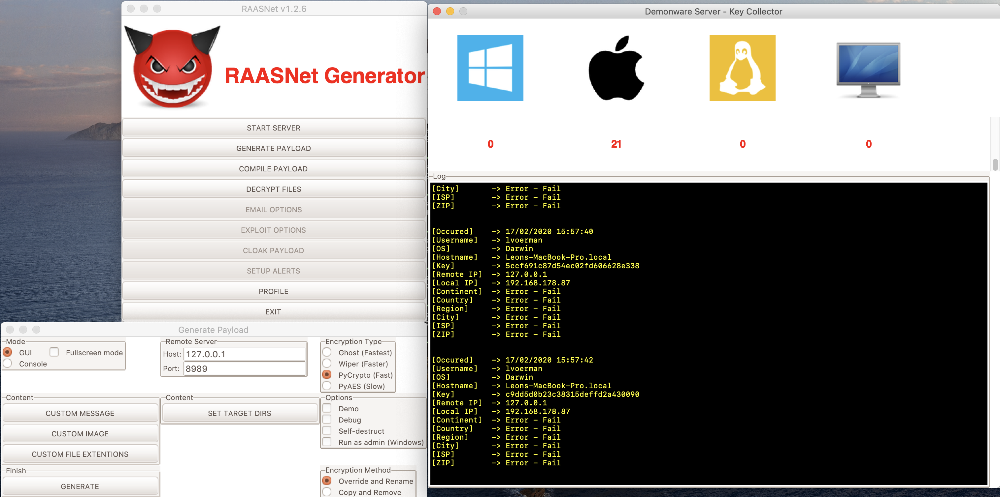
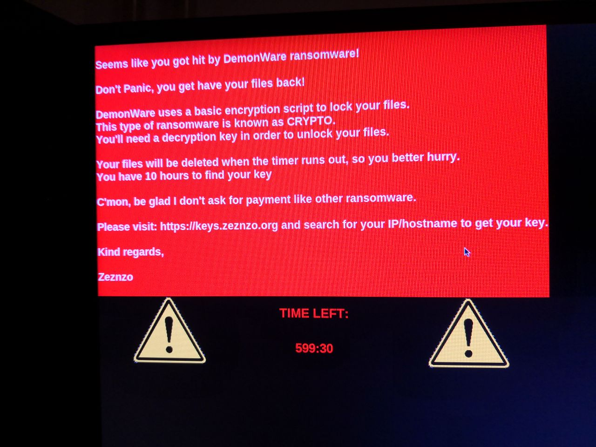

<h1 align="center">
   RAASNet
</h1>

<h3 align="center">
   jezsjxtthkqhlqoc.onion
</h3>


<p align="center">
  Ransomware As A Service
</p>





<h1 align="center">
  Super Fast Encryption!
</h1>
<br>


<br>

<h1 align="center">
   Usage Demo
</h1>

<a href="https://www.youtube.com/watch?v=2GQaWL6eSxA" target="_blank"></a>

<h1 align="center">
   Please read
</h1>
<br>
<p align=center>
   This was made to demonstrate ransomware and how easy it is to make. It works on Windows, Linux and MacOS. It's recommended to compile payload.py to EXE to make it more portable.
</p>

<p align=center>
   I do work on security awareness trainings and test the IT security and safety for other companies and you guessed it; this was made for the demo section of my presentation, NOT TO EARN MONEY OR BRICK PEOPLES COMPUTERS.
</p>

<p align=center>
   This script does not get detected by any anti-virusses. Self made scripts go undetected 99% of the time. It's easy to write something nasty like ransomware, adware, malware, you name it. Again, this script was for research only. Not ment to be used in the open world. I am not responsible for any damage you may cause with this knowledge. 
</p>

<p align=center>
   I recommend a VPN that allows port forwarding (For example; PIA VPN) when using this outside your network, or better, a cloud computer hosted elsewhere, like Amazon AWS. 
</p>

<p align=center>
   The conclusion of this project is that it is easy to brick a system and earn money doing it. This script doesn't use any exploits to achieve its goal, but can easily be coded into it as a nice feature.
</p>
<br>

<h1 align="center">
   Features
</h1>
<br>

+ Generate a ransomware payload
+ With or without GUI payload
+ FUD (Fully Undetectable by Anti-Virus)
+ Works on Windows, MacOS and Linux
+ Super fast encryption with PyCrypto
+ Compile to EXE, APP or Unix/Linux executable
+ Custom icon for your EXE payload
+ Receive keys of victims
+ Decrypt files
+ Demo mode (payload won't encrypt anything)
+ Fullscreen mode (Warning takes over the screen)
+ Custom warning message for your victim
+ Custom image in your payload
+ Ghost mode (Rename by adding .DEMON extention instead of encrypting the files)
+ Multiple encryption methods
+ Select file extentions to target
+ Decide if payload should self-destruct (Console mode feature only)
+ Decide wich drive to target for encryption (working directory)
+ Verified server access through port forwarding VPN

<h1 align="center">
   Installation
</h1>

Download and install the latest version of Python 3.<br>
<br>
Then do:<br>
```Shell
git clone https://github.com/leonv024/RAASNet.git
```

```Shell
pip3 install -r requirements.txt
```

```Shell
python3 RAASNet.py
```

On Linux, you might need to install these packages:
```Shell
sudo apt install python3-tk python3-pil python3-pil.imagetk
```

Testing connection with remote server:
```Shell
# Change the host and port in test_socket.py, default is 127.0.0.1 on port 8989
python3 test_socket.py
```

<a href="https://www.buymeacoffee.com/Zeznzo" target="_blank">Buy me a coffee :)</a>
